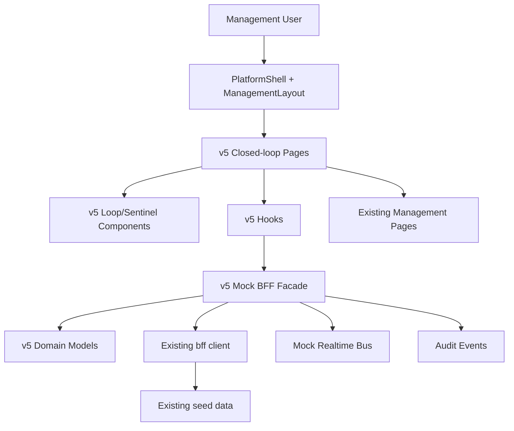
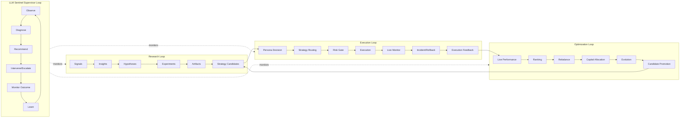
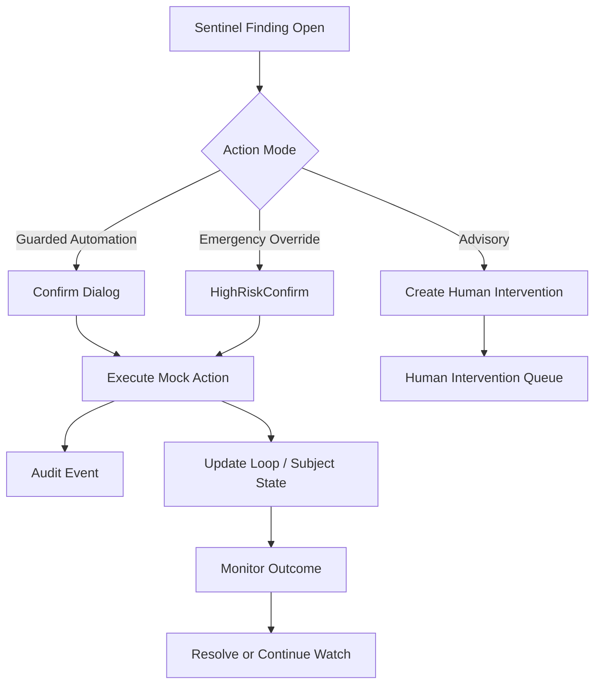

# Pantheon v5 Closed-Loop Supervisor OS — SD 文件

**文件類型**：SD（System Design / Solution Design）  
**版本**：v5-SD-2026-05-06-A  
**對應 SA**：`Pantheon_v5_Closed_Loop_Supervisor_OS_SA_2026-05-06.md`  
**範圍**：Pantheon / Pathreon 多人格交易系統之前端管理者操作系統重構  
**基準 repo**：`ajoe734/execute-plans` / `main`  
**設計策略**：共融式重構；保留現有管理組件，新增 Closed-loop Supervisor OS 上層操作層。  
**主要交付對象**：Lovable 實作代理、前端工程、BFF 工程、LLM Agent 工程、QA。  

---

## 0. SD 摘要

本 SD 將 SA 中提出的 **Pantheon v5 Closed-Loop Supervisor OS** 落成可實作的前端系統設計。核心不是重寫既有前端，而是在現有管理頁與 mock BFF 之上新增一層「閉環操作層」。

現有頁面包含 Strategy、Persona、Capital、Ranking、Rebalance、Evolution、Deployments、Risk、Jobs、Alerts、Incidents、Approvals、Audit、Tools、MCP、Skills、Studios 等。這些保留為 drill-down、manual override、evidence、audit、resource management 頁。

新增 v5 層負責讓管理者監督 Pantheon 這個自動交易生態：

```text
Research Loop      研發閉環：Signal → Insight → Experiment → Artifact → Strategy Candidate
Execution Loop     執行閉環：Persona Decision → Routing → Risk Gate → Execution → Monitor → Incident/Rollback
Optimization Loop  優化閉環：Performance → Ranking → Rebalance → Allocation → Evolution → Promotion
Supervisor Loop    監督閉環：Observe → Diagnose → Recommend → Intervene/Escalate → Monitor → Learn
```

本 SD 的主要實作結果：

1. 新增 v5 domain model：`LoopRun`、`LoopStage`、`PersonaExecutionHealth`、`StrategyExecutionHealth`、`OptimizationRun`、`SentinelFinding`、`RemediationAction`、`InterventionItem`。
2. 新增 v5 mock BFF：`bff.v5.controlRoom`、`bff.v5.loopRuns`、`bff.v5.execution`、`bff.v5.optimization`、`bff.v5.sentinel`、`bff.v5.interventions`。
3. 新增 v5 routes：`/management/control-room`、`/management/loops`、`/management/loops/research`、`/management/loops/execution`、`/management/loops/optimization`、`/management/sentinel`、`/management/interventions`。
4. 新增 v5 pages：Pantheon Control Room、Loop Runs、Execution Loop、Optimization Loop、Research Loop、Sentinel Findings、Human Intervention Queue。
5. 既有頁面只做連結與 drill-down，不刪除、不破壞原 route。
6. 將 LLM Sentinel 從「聊天 / committee 工具」提升為 structured supervisor：異常診斷、evidence、blast radius、修正方案、處置等級、audit trail。
7. 將 Human Intervention Queue 從單純 approval list 升級為「所有阻塞閉環的人類決策入口」。

---

## 1. 設計原則

### 1.1 共融式重構

採用 **上層重構、下層保留**。

```text
New v5 Closed-loop Supervisor Layer
  ↓ drill-down / evidence / manual action
Existing Management Pages and Components
  ↓ mock data / mutations / realtime events
Existing Mock BFF and Seed Data
```

不得在 v5 第一階段重寫既有 detail pages。既有頁面應被重新掛接到 v5 的 loop/stage/finding/intervention flow 裡。

### 1.2 閉環優先，不以 entity 優先

舊 IA 偏向 entity-first：Strategies、Personas、Capital、Ranking、Rebalance、Evolution。v5 改為 loop-first：Research、Execution、Optimization、Supervisor。

管理者進入系統時，第一問題不是「我要管理哪個物件」，而是：

```text
哪個閉環正在跑？
哪個閉環卡住？
哪個 persona / strategy / capital pool 異常？
LLM Sentinel 怎麼診斷？
我現在是否需要介入？
```

### 1.3 LLM Sentinel 必須 structured，不是聊天框

Sentinel 不能只是「問 AI」或「AI chat」。它必須輸出可被 UI、BFF、audit、approval 使用的結構化 finding：

```text
Finding → Diagnosis → Evidence → Blast Radius → Recommended Actions → Intervention / Auto Action → Outcome Tracking
```

### 1.4 人類介入要表達 downstream effect

每個 approval / sentinel recommendation / emergency review 都必須說明：

```text
approve 後會觸發什麼？
reject 後會回到哪裡？
它阻塞哪個 loop run？
它影響哪些 persona / strategy / capital pool / deployment？
```

### 1.5 可先 mock，但 mock 必須像真系統

第一階段可以由現有 seed data 派生 loop / sentinel / intervention data。mock 資料不可只是靜態文案，必須可互動、可篩選、可更新、可產生 audit/realtime event。

---

## 2. 與現有 repo 的關係

### 2.1 現有路由保留

目前 `App.tsx` 中 `/management` 下已有大量 routes，包括：

```text
/management/command-center
/management/overview
/management/risk
/management/strategies
/management/strategies/:id
/management/personas
/management/personas/:id
/management/capital
/management/ranking
/management/rebalance
/management/evolution
/management/experiments
/management/artifacts
/management/governance
/management/deployments
/management/runtimes
/management/jobs
/management/alerts
/management/incidents
/management/audit
/management/approvals
/management/tools
/management/mcp
/management/skills
/management/channels
/management/studios/*
```

v5 不刪除這些 routes，而是新增 routes 並調整 nav grouping。

### 2.2 現有 ManagementLayout 的改造方式

目前 `src/management/ManagementLayout.tsx` 的 groups 是：

```text
Command
Core Management
Research / Governance
Operations
Capabilities
System
```

v5 應改成：

```text
Control Room
Execution Loop
Optimization Loop
Research Loop
Multi-Persona System
Risk & Governance
Infrastructure
Settings
```

但 implementation 應分兩階段：

1. Phase E1：新增 v5 groups 在上方，舊 groups 保留為 Legacy / Assets / Advanced。
2. Phase E7：將舊 groups 完整重排到新 IA；舊 deep links 全部保留。

### 2.3 現有 BFF 保留

目前 `src/lib/bff/client.ts` 提供 `bff.strategies.list()`、`bff.personas.list()`、`bff.jobs.list()` 等。v5 不改現有 method signature，先新增：

```ts
bff.v5 = {
  controlRoom: { get: ... },
  loopRuns: { list: ..., get: ... },
  research: { getOverview: ... },
  execution: { getOverview: ..., listPersonaHealth: ..., getPersonaHealth: ... },
  optimization: { getOverview: ..., listRuns: ..., getRun: ... },
  sentinel: { listFindings: ..., getFinding: ..., acknowledgeFinding: ..., executeAction: ... },
  interventions: { list: ..., decide: ... },
};
```

既有 list data 可被 v5 mock adapter 聚合。

---

## 3. v5 系統分層

### 3.1 分層圖



### 3.2 層級職責

| 層 | 職責 | 目錄建議 |
|---|---|---|
| v5 models | 型別、enum、helper、score calculation | `src/lib/v5/types.ts`、`src/lib/v5/health.ts` |
| v5 mock adapters | 從現有 seed 派生 loop/sentinel/intervention data | `src/lib/v5/mockSeed.ts`、`src/lib/v5/adapters.ts` |
| v5 BFF facade | 提供 page-level data API | `src/lib/bff/v5.ts` 或 `src/lib/v5/bff.ts` |
| v5 hooks | React hooks | `src/lib/v5/hooks.ts` |
| v5 components | loop lane、health card、finding card 等 | `src/management/components/v5/*` |
| v5 pages | Control Room、Execution Loop、Optimization Loop 等 | `src/management/pages/v5/*` |
| existing pages | drill-down / manual operation | `src/management/pages/*` |

---

## 4. 新增檔案結構

### 4.1 建議新增目錄

```text
src/lib/v5/
  index.ts
  types.ts
  constants.ts
  health.ts
  score.ts
  adapters.ts
  mockSeed.ts
  bff.ts
  events.ts
  hooks.ts
  selectors.ts
  remediation.ts
  tests/
    health.test.ts
    selectors.test.ts
    remediation.test.ts

src/management/components/v5/
  AutonomyStatusCard.tsx
  LoopStatusLane.tsx
  LoopStageRail.tsx
  LoopRunCard.tsx
  LoopBlockerBadge.tsx
  PersonaTradingHealthCard.tsx
  StrategyExecutionHealthCard.tsx
  OptimizationRunTimeline.tsx
  SentinelFindingCard.tsx
  SentinelEvidenceDrawer.tsx
  RemediationActionList.tsx
  HumanGateImpactPanel.tsx
  InterventionItemCard.tsx
  InterventionDecisionDialog.tsx
  SupervisorVerdictBadge.tsx
  EmergencyActionBadge.tsx
  HealthScoreGauge.tsx

src/management/pages/v5/
  PantheonControlRoom.tsx
  LoopRunsPage.tsx
  ResearchLoopPage.tsx
  ExecutionLoopPage.tsx
  OptimizationLoopPage.tsx
  SentinelFindingsPage.tsx
  HumanInterventionQueuePage.tsx
```

### 4.2 不建議新增的東西

第一階段不新增：

```text
new StrategyDetailV5
new PersonaDetailV5
new RankingDashboardV5
new RebalanceDetailV5
new EvolutionDetailV5
```

原因：既有 detail pages 已有高價值內容，v5 應先作為上層 orchestrator。

---

## 5. Routing Design

### 5.1 新 routes

在 `src/App.tsx` 的 `/management` nested routes 中新增：

```tsx
<Route path="control-room" element={<PantheonControlRoom />} />
<Route path="loops" element={<LoopRunsPage />} />
<Route path="loops/research" element={<ResearchLoopPage />} />
<Route path="loops/execution" element={<ExecutionLoopPage />} />
<Route path="loops/optimization" element={<OptimizationLoopPage />} />
<Route path="sentinel" element={<SentinelFindingsPage />} />
<Route path="interventions" element={<HumanInterventionQueuePage />} />
```

### 5.2 Index route

第一階段可保留：

```tsx
<Route index element={<CommandCenter />} />
```

完成 v5 control room 後改成：

```tsx
<Route index element={<Navigate to="/management/control-room" replace />} />
```

或直接：

```tsx
<Route index element={<PantheonControlRoom />} />
```

### 5.3 Backward compatibility

舊 routes 不刪除：

```text
/management/command-center
/management/risk
/management/ranking
/management/rebalance
/management/evolution
/management/studios/*
/management/jobs
/management/alerts
/management/incidents
/management/approvals
```

v5 pages 使用這些 routes 作 drill-down。

---

## 6. Navigation Design

### 6.1 新 nav group

`ManagementLayout.tsx` 的 nav groups 建議改成：

```ts
const groups: NavGroup[] = [
  {
    label: t("groups.controlRoom"),
    items: [
      { to: "/management/control-room", label: t("nav.pantheonOverview"), icon: LayoutDashboard },
      { to: "/management/loops", label: t("nav.loopRuns"), icon: Workflow },
      { to: "/management/sentinel", label: t("nav.sentinelFindings"), icon: Brain },
      { to: "/management/interventions", label: t("nav.humanInterventions"), icon: ClipboardCheck },
    ],
  },
  {
    label: t("groups.executionLoop"),
    items: [
      { to: "/management/loops/execution", label: t("nav.executionLoop"), icon: Activity },
      { to: "/management/personas", label: t("nav.personas"), icon: Users },
      { to: "/management/deployments", label: t("nav.deployments"), icon: Rocket },
      { to: "/management/runtimes", label: t("nav.runtimes"), icon: Server },
      { to: "/management/jobs", label: t("nav.jobs"), icon: ListChecks },
      { to: "/management/alerts", label: t("nav.alerts"), icon: Bell },
      { to: "/management/incidents", label: t("nav.incidents"), icon: AlertOctagon },
    ],
  },
  {
    label: t("groups.optimizationLoop"),
    items: [
      { to: "/management/loops/optimization", label: t("nav.optimizationLoop"), icon: Repeat },
      { to: "/management/ranking", label: t("nav.ranking"), icon: ListOrdered },
      { to: "/management/rebalance", label: t("nav.rebalance"), icon: Repeat },
      { to: "/management/evolution", label: t("nav.evolution"), icon: GitBranch },
      { to: "/management/capital", label: t("nav.capital"), icon: Wallet },
      { to: "/management/studios", label: t("nav.studios"), icon: Beaker },
    ],
  },
  {
    label: t("groups.researchLoop"),
    items: [
      { to: "/management/loops/research", label: t("nav.researchLoop"), icon: FlaskConical },
      { to: "/management/alpha-factory", label: t("nav.alphaFactory"), icon: Factory },
      { to: "/management/experiments", label: t("nav.experiments"), icon: FlaskConical },
      { to: "/management/artifacts", label: t("nav.artifacts"), icon: Database },
      { to: "/management/knowledge", label: t("nav.knowledge"), icon: BookOpen },
    ],
  },
  {
    label: t("groups.multiPersona"),
    items: [
      { to: "/management/personas", label: t("nav.personas"), icon: Users },
      { to: "/management/governance/consult", label: t("nav.consultRules"), icon: MessagesSquare },
      { to: "/management/governance/memory", label: t("nav.memoryGov"), icon: Brain },
      { to: "/management/skills", label: t("nav.skills"), icon: Sparkles },
    ],
  },
  {
    label: t("groups.riskGovernance"),
    items: [
      { to: "/management/risk", label: t("nav.riskCenter"), icon: AlertOctagon },
      { to: "/management/governance", label: t("nav.governance"), icon: ClipboardCheck },
      { to: "/management/governance/policies", label: t("nav.routePolicies"), icon: ShieldCheck },
      { to: "/management/governance/permissions", label: t("nav.permissions"), icon: ShieldCheck },
      { to: "/management/audit", label: t("nav.audit"), icon: ScrollText },
    ],
  },
  {
    label: t("groups.infrastructure"),
    items: [
      { to: "/management/tools", label: t("nav.tools"), icon: Wrench },
      { to: "/management/mcp", label: t("nav.mcp"), icon: Network },
      { to: "/management/channels", label: t("nav.channels"), icon: Radio },
      { to: "/management/workflows", label: t("nav.workflowTemplates"), icon: Workflow },
      { to: "/management/hooks", label: t("nav.hooks"), icon: Clock },
    ],
  },
  {
    label: t("groups.system"),
    items: [
      { to: "/management/settings", label: t("nav.settings"), icon: Settings },
    ],
  },
];
```

### 6.2 重複項目處理

`Personas` 同時屬於 Execution Loop 與 Multi-Persona System。第一階段可重複放置，因為使用者心智入口不同。

第二階段可將 `/management/personas` 保留在 Multi-Persona System，Execution Loop 中改為 `/management/loops/execution?focus=personas`。

---

## 7. Domain Model Design

### 7.1 基礎 enum

```ts
export type LoopType = "research" | "execution" | "optimization";

export type SupervisorLoopType = LoopType | "supervisor";

export type LoopStatus =
  | "running"
  | "watch"
  | "blocked"
  | "paused"
  | "emergency"
  | "completed";

export type HealthStatus =
  | "healthy"
  | "watch"
  | "degraded"
  | "critical"
  | "unknown";

export type AutonomyMode =
  | "manual"
  | "assisted"
  | "guarded_auto"
  | "autopilot"
  | "emergency_safe";

export type InterventionSeverity = "low" | "medium" | "high" | "critical";

export type RemediationMode =
  | "advisory"
  | "guarded_automation"
  | "emergency_override";
```

### 7.2 LoopStage

```ts
export interface LoopStage {
  id: string;
  label: string;
  loopType: LoopType;
  order: number;
  status: "idle" | "running" | "completed" | "blocked" | "warning" | "failed";
  startedAt?: string;
  completedAt?: string;
  owner?: string;
  ownerType?: "system" | "persona" | "human" | "sentinel";
  linkedEntity?: {
    type: string;
    id: string;
    name?: string;
    route?: string;
  };
  metrics?: Record<string, string | number | boolean>;
  blockers?: string[];
  nextAction?: string;
  humanGateRequired?: boolean;
}
```

### 7.3 LoopRun

```ts
export interface LoopRun {
  id: string;
  loopType: LoopType;
  title: string;
  status: LoopStatus;
  autonomyMode: AutonomyMode;
  currentStageId: string;
  trigger: "schedule" | "signal" | "risk_breach" | "human" | "sentinel" | "market_event";
  startedAt: string;
  updatedAt: string;
  completedAt?: string;
  subjects: {
    strategies?: string[];
    personas?: string[];
    capitalPools?: string[];
    deployments?: string[];
    artifacts?: string[];
    approvals?: string[];
    incidents?: string[];
  };
  stages: LoopStage[];
  nextAutomaticAction?: string;
  blockedBy?: string[];
  humanGateRequired: boolean;
  sentinelFindingIds?: string[];
  interventionItemIds?: string[];
  auditEventIds?: string[];
}
```

### 7.4 PersonaExecutionHealth

```ts
export interface PersonaExecutionHealth {
  personaId: string;
  personaName: string;
  archetype: string;
  mode: "live" | "paper" | "shadow" | "suspended";
  healthStatus: HealthStatus;
  healthScore: number; // 0..100
  activeStrategies: number;
  liveStrategies: number;
  paperStrategies: number;
  openPositions: number;
  notionalExposureUsd: number;
  pnl24hPct: number;
  pnl7dPct: number;
  drawdownPct: number;
  decisionQuality: {
    score: number; // 0..1
    trend: "improving" | "stable" | "degrading";
    recentDecisions: number;
    rejectedDecisions: number;
  };
  executionQuality: {
    latencyP95Ms: number;
    slippageBps: number;
    fillRatePct: number;
    orderRejectRatePct: number;
  };
  policy: {
    violations24h: number;
    consultRuleBreaches: number;
    routePolicyBreaches: number;
  };
  risk: {
    riskLevel: "low" | "medium" | "high" | "critical";
    openBreaches: number;
    concentrationPct: number;
    livePaperDivergencePct: number;
  };
  supervisor: {
    verdict: "healthy" | "watch" | "intervene" | "emergency";
    summary: string;
    findingIds: string[];
    recommendedActionIds: string[];
  };
  updatedAt: string;
}
```

### 7.5 StrategyExecutionHealth

```ts
export interface StrategyExecutionHealth {
  strategyId: string;
  strategyName: string;
  lifecycleStatus: string;
  deploymentMode: "none" | "paper" | "live" | "shadow";
  ownerPersonas: string[];
  healthStatus: HealthStatus;
  riskLevel: "low" | "medium" | "high" | "critical";
  pnl24hPct: number;
  pnl30dPct: number;
  sharpe: number;
  drawdownPct: number;
  livePaperDivergencePct: number;
  slippageBps: number;
  openAlerts: number;
  openIncidents: number;
  recommendedAction?: string;
  route: string;
}
```

### 7.6 OptimizationRun

```ts
export interface OptimizationRun {
  id: string;
  title: string;
  status: LoopStatus;
  scope: "portfolio" | "capital_pool" | "strategy_family" | "persona" | "live" | "paper";
  scopeId?: string;
  trigger: "schedule" | "performance_drift" | "risk_breach" | "human" | "sentinel";
  startedAt: string;
  updatedAt: string;
  stages: LoopStage[];
  ranking: {
    formulaId: string;
    formulaName: string;
    recalculatedAt?: string;
    topCandidates: string[];
    frozen: boolean;
  };
  rebalance: {
    rebalanceId?: string;
    simulationId?: string;
    constraintStatus: "not_run" | "passed" | "warning" | "failed";
    proposedDeltaPct: number;
  };
  capital: {
    affectedPools: string[];
    maxUtilizationPct: number;
    breachCount: number;
  };
  evolution: {
    programIds: string[];
    activeRuns: number;
    promotionCandidates: number;
  };
  blockedBy?: string[];
  sentinelFindingIds?: string[];
  interventionItemIds?: string[];
  nextAutomaticAction?: string;
}
```

### 7.7 Evidence

```ts
export interface EvidenceRef {
  id: string;
  type:
    | "metric"
    | "alert"
    | "incident"
    | "job"
    | "audit"
    | "strategy"
    | "persona"
    | "deployment"
    | "runtime"
    | "policy"
    | "approval";
  label: string;
  value?: string | number;
  previousValue?: string | number;
  unit?: string;
  severity?: InterventionSeverity;
  route?: string;
  observedAt: string;
}
```

### 7.8 RemediationAction

```ts
export type RemediationActionType =
  | "observe"
  | "open_incident"
  | "acknowledge_alert"
  | "reduce_allocation"
  | "pause_persona_routing"
  | "switch_persona_to_shadow"
  | "rollback_deployment"
  | "freeze_rebalance"
  | "rerun_ranking"
  | "start_evolution_run"
  | "request_human_approval"
  | "disable_tool"
  | "route_to_backup_runtime"
  | "create_postmortem";

export interface RemediationAction {
  id: string;
  type: RemediationActionType;
  label: string;
  mode: RemediationMode;
  riskLevel: InterventionSeverity;
  target: {
    type: string;
    id: string;
    name?: string;
    route?: string;
  };
  rationale: string;
  expectedEffect: string;
  possibleSideEffects?: string[];
  requiresHumanApproval: boolean;
  confirmTokenRequired: boolean;
  enabled: boolean;
  disabledReason?: string;
  downstreamEvents?: string[];
}
```

### 7.9 SentinelFinding

```ts
export interface SentinelFinding {
  id: string;
  severity: "info" | "watch" | "warning" | "critical";
  status: "open" | "acknowledged" | "action_pending" | "mitigating" | "resolved" | "dismissed";
  loopType: LoopType;
  subjectType: "persona" | "strategy" | "capitalPool" | "runtime" | "policy" | "portfolio" | "deployment";
  subjectId: string;
  subjectName: string;
  title: string;
  diagnosis: string;
  confidence: number; // 0..1
  evidence: EvidenceRef[];
  blastRadius: {
    strategies: string[];
    personas: string[];
    capitalPools: string[];
    deployments: string[];
    runtimes: string[];
  };
  recommendedActions: RemediationAction[];
  emergencyEligible: boolean;
  requiresHumanApproval: boolean;
  createdAt: string;
  updatedAt: string;
  resolvedAt?: string;
  linkedLoopRunIds?: string[];
  linkedInterventionIds?: string[];
}
```

### 7.10 InterventionItem

```ts
export interface InterventionItem {
  id: string;
  source: "approval" | "sentinel" | "incident" | "policy_exception" | "emergency_review" | "manual_override";
  loopType: LoopType;
  severity: InterventionSeverity;
  status: "pending" | "approved" | "rejected" | "expired" | "cancelled";
  title: string;
  description: string;
  blocksLoopRunId?: string;
  subject: {
    type: string;
    id: string;
    name?: string;
    route?: string;
  };
  recommendedDecision?: "approve" | "reject" | "modify" | "escalate" | "observe";
  supervisorConfidence?: number;
  approveEffect: string;
  rejectEffect: string;
  requiredRoles?: string[];
  dueAt?: string;
  createdAt: string;
  linkedApprovalId?: string;
  linkedFindingId?: string;
  linkedIncidentId?: string;
}
```

### 7.11 ControlRoomSummary

```ts
export interface ControlRoomSummary {
  generatedAt: string;
  autonomy: {
    mode: AutonomyMode;
    globalStatus: LoopStatus;
    emergencyMode: boolean;
    summary: string;
  };
  loops: {
    research: LoopRun;
    execution: LoopRun;
    optimization: LoopRun;
  };
  sentinel: {
    openFindings: number;
    criticalFindings: number;
    latestFindingIds: string[];
    verdict: "healthy" | "watch" | "intervene" | "emergency";
  };
  interventions: {
    pending: number;
    blocking: number;
    critical: number;
    dueSoon: number;
  };
  execution: {
    personasLive: number;
    personasWatch: number;
    liveStrategies: number;
    degradedStrategies: number;
    openIncidents: number;
  };
  optimization: {
    activeRuns: number;
    blockedRuns: number;
    promotionCandidates: number;
    pendingRebalance: number;
  };
}
```

---

## 8. Mock BFF Design

### 8.1 v5 BFF namespace

在 `src/lib/v5/bff.ts` 實作：

```ts
export const bffV5 = {
  controlRoom: {
    get: (): Promise<ControlRoomSummary> => ...,
  },
  loopRuns: {
    list: (filter?: { loopType?: LoopType; status?: LoopStatus }): Promise<LoopRun[]> => ...,
    get: (id: string): Promise<LoopRun | undefined> => ...,
  },
  research: {
    getOverview: (): Promise<ResearchLoopOverview> => ...,
  },
  execution: {
    getOverview: (): Promise<ExecutionLoopOverview> => ...,
    listPersonaHealth: (): Promise<PersonaExecutionHealth[]> => ...,
    getPersonaHealth: (personaId: string): Promise<PersonaExecutionHealth | undefined> => ...,
    listStrategyHealth: (): Promise<StrategyExecutionHealth[]> => ...,
  },
  optimization: {
    getOverview: (): Promise<OptimizationLoopOverview> => ...,
    listRuns: (): Promise<OptimizationRun[]> => ...,
    getRun: (id: string): Promise<OptimizationRun | undefined> => ...,
  },
  sentinel: {
    listFindings: (filter?: SentinelFindingFilter): Promise<SentinelFinding[]> => ...,
    getFinding: (id: string): Promise<SentinelFinding | undefined> => ...,
    acknowledgeFinding: (id: string, memo?: string): Promise<MutationResult> => ...,
    executeAction: (findingId: string, actionId: string, memo?: string): Promise<MutationResult> => ...,
    dismissFinding: (id: string, memo: string): Promise<MutationResult> => ...,
  },
  interventions: {
    list: (filter?: InterventionFilter): Promise<InterventionItem[]> => ...,
    decide: (id: string, decision: "approve" | "reject" | "modify" | "escalate", memo: string): Promise<MutationResult> => ...,
  },
};
```

再在 `src/lib/bff/client.ts` 中匯入並掛載：

```ts
import { bffV5 } from "@/lib/v5/bff";

export const bff = {
  ...existing,
  v5: bffV5,
};
```

若不想改 `client.ts`，v5 pages 可直接 import `bffV5`。但建議掛到 `bff.v5`，方便語意統一。

### 8.2 派生資料策略

第一階段不需新增大量 seed。可從現有 seed 派生：

| v5 資料 | 來源 |
|---|---|
| PersonaExecutionHealth | personas + strategies + alerts + incidents + jobs |
| StrategyExecutionHealth | strategies + deployments + alerts + incidents |
| OptimizationRun | rankingFormulas + rebalances + evolutionPrograms + approvals |
| SentinelFinding | alerts + incidents + runtime warning + high-risk strategy drawdown |
| InterventionItem | approvals + sentinel findings + incidents |
| LoopRun | strategies/research/evolution/rebalance/jobs/approvals aggregate |

### 8.3 Mock data generation examples

```ts
export function derivePersonaExecutionHealth(): PersonaExecutionHealth[] {
  return seed.personas.map((p) => {
    const ownedStrategies = seed.strategies.filter((s) => s.personaIds.includes(p.id));
    const liveStrategies = ownedStrategies.filter((s) => s.state === "deployed");
    const openAlerts = seed.alerts.filter((a) =>
      ownedStrategies.some((s) => a.relatedTarget === s.id || a.title.includes(s.id)),
    );
    const openIncidents = seed.incidents.filter((i) =>
      ownedStrategies.some((s) => i.affected?.includes(s.id)),
    );

    const drawdownPct = ownedStrategies.length
      ? Math.min(...ownedStrategies.map((s) => s.drawdown * 100))
      : 0;

    const riskLevel = openIncidents.some((i) => i.severity === "critical")
      ? "critical"
      : openAlerts.some((a) => a.severity === "high" || a.severity === "critical")
        ? "high"
        : p.risk;

    const healthScore = computePersonaHealthScore({ p, ownedStrategies, openAlerts, openIncidents });

    return {
      personaId: p.id,
      personaName: p.name,
      archetype: p.archetype,
      mode: liveStrategies.length ? "live" : "paper",
      healthStatus: scoreToHealthStatus(healthScore),
      healthScore,
      activeStrategies: ownedStrategies.length,
      liveStrategies: liveStrategies.length,
      paperStrategies: ownedStrategies.length - liveStrategies.length,
      openPositions: liveStrategies.length * 3,
      notionalExposureUsd: liveStrategies.length * 1_250_000,
      pnl24hPct: average(ownedStrategies.map((s) => s.pnl30d / 30)),
      pnl7dPct: average(ownedStrategies.map((s) => s.pnl30d / 30 * 7)),
      drawdownPct,
      decisionQuality: {
        score: p.successRate,
        trend: p.successRate > 0.75 ? "stable" : "degrading",
        recentDecisions: Math.max(12, p.routedStrategies * 8),
        rejectedDecisions: Math.round((1 - p.successRate) * 10),
      },
      executionQuality: {
        latencyP95Ms: p.risk === "high" ? 980 : 420,
        slippageBps: openAlerts.length ? 7.1 : 2.4,
        fillRatePct: openAlerts.length ? 91 : 98,
        orderRejectRatePct: openIncidents.length ? 4.5 : 0.4,
      },
      policy: {
        violations24h: openAlerts.length,
        consultRuleBreaches: 0,
        routePolicyBreaches: 0,
      },
      risk: {
        riskLevel,
        openBreaches: openAlerts.length,
        concentrationPct: liveStrategies.length ? 32 : 0,
        livePaperDivergencePct: openAlerts.length ? 8.4 : 1.8,
      },
      supervisor: buildSupervisorVerdictForPersona(p, ownedStrategies, openAlerts, openIncidents),
      updatedAt: now(),
    };
  });
}
```

---

## 9. Event Design

### 9.1 Event principles

v5 不需要第一階段重寫現有 realtime bus，但需新增 event type conventions。

建議新增 event topics：

```text
loop
sentinel
intervention
execution_health
optimization
```

現有 `realtime.emit("data", { kind })` 可繼續使用。v5 在 mutation 後同時 emit typed event。

### 9.2 v5 event envelope

```ts
export interface V5EventEnvelope<T> {
  id: string;
  schemaVersion: 1;
  topic: "loop" | "sentinel" | "intervention" | "execution_health" | "optimization";
  type: string;
  occurredAt: string;
  correlationId: string;
  payload: T;
}
```

### 9.3 Event union

```ts
export type V5RealtimeEvent =
  | V5EventEnvelope<{ loopRunId: string; status: LoopStatus; currentStageId: string } & { type: "loop.status.changed" }>
  | V5EventEnvelope<{ findingId: string; severity: string; status: string } & { type: "sentinel.finding.updated" }>
  | V5EventEnvelope<{ interventionId: string; status: string; decision?: string } & { type: "intervention.decided" }>
  | V5EventEnvelope<{ personaId: string; healthStatus: HealthStatus; score: number } & { type: "execution.persona_health.changed" }>
  | V5EventEnvelope<{ optimizationRunId: string; status: LoopStatus; stageId: string } & { type: "optimization.run.updated" }>;
```

### 9.4 Mutations that should emit v5 events

| Mutation | Existing side effect | v5 event |
|---|---|---|
| acknowledgeFinding | update finding status | `sentinel.finding.updated` |
| executeAction | depending action | `sentinel.action.executed` + possible `loop.status.changed` |
| decideIntervention | update intervention status | `intervention.decided` |
| openIncident from Sentinel | create incident | `sentinel.action.executed` + `data:{kind:"Incident"}` |
| pause persona routing | update persona health mode | `execution.persona_health.changed` |
| rerun ranking | create job | `optimization.run.updated` + `job` |
| start evolution run | create evolution run/job | `optimization.run.updated` + `data:{kind:"Evolution"}` |

---

## 10. Hooks Design

### 10.1 Hook list

```ts
export function useControlRoom(): {
  summary?: ControlRoomSummary;
  loading: boolean;
  refresh: () => void;
};

export function useLoopRuns(filter?: LoopRunFilter): {
  rows: LoopRun[];
  loading: boolean;
  refresh: () => void;
};

export function useExecutionLoop(): {
  overview?: ExecutionLoopOverview;
  personas: PersonaExecutionHealth[];
  strategies: StrategyExecutionHealth[];
  loading: boolean;
  refresh: () => void;
};

export function useOptimizationLoop(): {
  overview?: OptimizationLoopOverview;
  runs: OptimizationRun[];
  loading: boolean;
  refresh: () => void;
};

export function useSentinelFindings(filter?: SentinelFindingFilter): {
  rows: SentinelFinding[];
  active?: SentinelFinding;
  setActive: (f?: SentinelFinding) => void;
  acknowledge: (id: string, memo?: string) => Promise<void>;
  executeAction: (findingId: string, actionId: string, memo?: string) => Promise<void>;
  dismiss: (id: string, memo: string) => Promise<void>;
  loading: boolean;
  refresh: () => void;
};

export function useInterventions(filter?: InterventionFilter): {
  rows: InterventionItem[];
  decide: (id: string, decision: InterventionDecision, memo: string) => Promise<void>;
  loading: boolean;
  refresh: () => void;
};
```

### 10.2 Realtime refresh

每個 hook 應訂閱相關 topic：

| Hook | Topics |
|---|---|
| useControlRoom | `loop`, `sentinel`, `intervention`, `execution_health`, `optimization`, `data:*` |
| useExecutionLoop | `execution_health`, `sentinel`, `data:Alert`, `data:Incident`, `data:Job` |
| useOptimizationLoop | `optimization`, `data:Rebalance`, `data:Evolution`, `data:Approval`, `data:Job` |
| useSentinelFindings | `sentinel`, `intervention` |
| useInterventions | `intervention`, `sentinel`, `data:Approval`, `data:Incident` |

### 10.3 Hook implementation pattern

```ts
export function useControlRoom() {
  const [summary, setSummary] = useState<ControlRoomSummary>();
  const [loading, setLoading] = useState(true);

  const refresh = useCallback(() => {
    setLoading(true);
    void bff.v5.controlRoom.get()
      .then(setSummary)
      .finally(() => setLoading(false));
  }, []);

  useEffect(() => {
    refresh();
    const offs = [
      realtime.on("loop", refresh),
      realtime.on("sentinel", refresh),
      realtime.on("intervention", refresh),
      realtime.on("data", refresh),
    ];
    return () => offs.forEach((off) => off?.());
  }, [refresh]);

  return { summary, loading, refresh };
}
```

---

## 11. Component Design

### 11.1 AutonomyStatusCard

Purpose：首頁頂部顯示全局 autonomous mode。

Props：

```ts
interface AutonomyStatusCardProps {
  mode: AutonomyMode;
  status: LoopStatus;
  emergencyMode: boolean;
  summary: string;
  updatedAt: string;
}
```

UI：

```text
Pantheon Autonomy
Mode: guarded_auto
Status: watch
Emergency: off
Summary: Execution loop under watch due to slippage anomaly.
```

### 11.2 LoopStatusLane

Purpose：用一列呈現一個閉環狀態。

Props：

```ts
interface LoopStatusLaneProps {
  loopRun: LoopRun;
  onOpen?: (run: LoopRun) => void;
}
```

Required display：

```text
Loop type
Status badge
Current stage
Next automatic action
Human gate count
Blockers
Sentinel findings count
CTA: Open loop
```

### 11.3 LoopStageRail

Purpose：視覺化 stage sequence。

Props：

```ts
interface LoopStageRailProps {
  stages: LoopStage[];
  currentStageId: string;
  compact?: boolean;
  onStageClick?: (stage: LoopStage) => void;
}
```

Status mapping：

```text
completed  ✓
running    animated pulse
blocked    alert icon
warning    warning icon
failed     destructive icon
idle       muted
```

### 11.4 PersonaTradingHealthCard

Purpose：Execution Loop 的核心 card。

Props：

```ts
interface PersonaTradingHealthCardProps {
  item: PersonaExecutionHealth;
  onOpenPersona?: (personaId: string) => void;
  onOpenFindings?: (findingIds: string[]) => void;
  onEmergencyAction?: (personaId: string) => void;
}
```

Required display：

```text
Persona name + mode
Health score + status
Active/live/paper strategies
PnL 24h / PnL 7d / Drawdown
Decision quality trend
Execution quality: latency, slippage, fill rate
Policy violations / risk breaches
Supervisor verdict + recommendation
CTA: Open persona / Open findings / Emergency action
```

### 11.5 OptimizationRunTimeline

Purpose：Optimization Loop 的 stage timeline。

Props：

```ts
interface OptimizationRunTimelineProps {
  run: OptimizationRun;
  onOpenRanking?: () => void;
  onOpenRebalance?: () => void;
  onOpenEvolution?: () => void;
  onOpenIntervention?: (id: string) => void;
}
```

Stages：

```text
Performance observed
Ranking recalculated
Candidate selection
Rebalance simulation
Constraint check
Governance gate
Capital apply
Evolution feedback
Candidate promotion
```

### 11.6 SentinelFindingCard

Purpose：structured anomaly card。

Props：

```ts
interface SentinelFindingCardProps {
  finding: SentinelFinding;
  compact?: boolean;
  onOpen?: (finding: SentinelFinding) => void;
  onAcknowledge?: (id: string) => void;
  onExecuteAction?: (findingId: string, actionId: string) => void;
}
```

Required display：

```text
Severity + loop type
Subject
Diagnosis summary
Confidence
Evidence count
Blast radius count
Recommended actions summary
Mode tags: advisory / guarded / emergency
Status
```

### 11.7 RemediationActionList

Purpose：Finding detail 中呈現 actions。

Props：

```ts
interface RemediationActionListProps {
  actions: RemediationAction[];
  findingId: string;
  onExecute: (findingId: string, actionId: string) => void;
}
```

Each action shows：

```text
Action label
Mode
Risk
Requires approval?
Expected effect
Side effects
Enabled / disabled reason
CTA
```

### 11.8 HumanGateImpactPanel

Purpose：Intervention detail 中說明 approve/reject downstream effect。

Props：

```ts
interface HumanGateImpactPanelProps {
  item: InterventionItem;
}
```

Display：

```text
Blocks loop run
Approve effect
Reject effect
Recommended decision
Supervisor confidence
Due time
Required roles
```

---

## 12. Page Design — Pantheon Control Room

### 12.1 Route

```text
/management/control-room
```

### 12.2 Data sources

```ts
bff.v5.controlRoom.get()
bff.v5.sentinel.listFindings({ status: "open", limit: 5 })
bff.v5.interventions.list({ status: "pending", limit: 5 })
```

### 12.3 Layout

```text
PageHeader
  Title: Pantheon Control Room
  Subtitle: Closed-loop autonomy and supervisor overview
  Actions: Refresh, Emergency Mode badge, Open Sentinel

Top Strip
  AutonomyStatusCard
  Research Loop Summary Card
  Execution Loop Summary Card
  Optimization Loop Summary Card
  Human Gates Summary Card
  Sentinel Summary Card

Loop Lanes
  Research Loop Lane
  Execution Loop Lane
  Optimization Loop Lane

Middle Section
  Left: Sentinel Critical Findings
  Right: Human Intervention Queue preview

Bottom Section
  Execution Health snapshot
  Optimization Run snapshot
  Recent Supervisor / Audit events
```

### 12.4 Required UX

Control Room must answer within 30 seconds：

1. Which loop is running / watch / blocked / emergency?
2. What is the current stage per loop?
3. What is the next automatic action?
4. Which human gates block progress?
5. What does Sentinel think is wrong?
6. What immediate actions are recommended?

### 12.5 Empty/loading states

| State | UI |
|---|---|
| loading | skeleton cards + loop rail skeleton |
| no loop runs | show onboarding empty: “No active loop runs. Open Alpha Factory / Ranking / Execution Loop.” |
| no sentinel findings | show healthy state |
| no interventions | show “No human gates blocking autonomy.” |

### 12.6 Interactions

| Click target | Behavior |
|---|---|
| Research Loop card | navigate `/management/loops/research` |
| Execution Loop card | navigate `/management/loops/execution` |
| Optimization Loop card | navigate `/management/loops/optimization` |
| Sentinel finding | navigate `/management/sentinel?finding=<id>` |
| Intervention item | navigate `/management/interventions?item=<id>` |
| Stage entity link | navigate existing detail page |

---

## 13. Page Design — Loop Runs Page

### 13.1 Route

```text
/management/loops
```

### 13.2 Purpose

顯示所有閉環運行紀錄與目前 active runs。不是 job list，而是 business/control loop list。

### 13.3 Layout

```text
Header + filters
  Loop type: all/research/execution/optimization
  Status: all/running/watch/blocked/emergency/completed
  Trigger: all/schedule/signal/risk_breach/human/sentinel

Active Runs Section
  LoopRunCard grid

Historical Runs Table
  Run ID
  Loop
  Status
  Trigger
  Current/Final Stage
  Started
  Duration
  Blockers
  Sentinel Findings
  Human Gates
```

### 13.4 Row click behavior

`LoopRunCard` click opens drawer:

```text
LoopRun detail drawer
- metadata
- stage rail
- subjects
- blockers
- Sentinel findings
- interventions
- audit events
- drill-down links
```

---

## 14. Page Design — Research Loop Page

### 14.1 Route

```text
/management/loops/research
```

### 14.2 Purpose

把現有 Alpha Factory、Experiments、Artifacts、Knowledge 串成研發閉環。

### 14.3 Stages

```text
Signals
Insights
Hypotheses
Experiments
Artifacts
Strategy Candidates
Review Gate
Paper Promotion
```

### 14.4 Data mapping

| Stage | Existing source |
|---|---|
| Signals | Agora signals / mock signal review |
| Insights | insight inbox / mock incoming |
| Hypotheses | research experiments hypothesis |
| Experiments | `bff.research.list()` |
| Artifacts | `bff.artifacts.list()` |
| Strategy Candidates | Alpha Factory candidates + strategies state draft/review |
| Review Gate | approvals / governance |
| Paper Promotion | deployments / strategy lifecycle |

### 14.5 Layout

```text
Research Loop stage rail
Alpha Factory pipeline section
Experiment status table
Artifact promotion candidates
Sentinel research findings
Human gates blocking research loop
```

### 14.6 Drill-down links

| UI | Route |
|---|---|
| Alpha candidate | `/management/alpha-factory` or `/management/strategies/:id` |
| Experiment | `/management/experiments/:id` |
| Artifact | `/management/artifacts/:id` |
| Review gate | `/management/governance/:id` |

---

## 15. Page Design — Execution Loop Page

### 15.1 Route

```text
/management/loops/execution
```

### 15.2 Purpose

Execution Loop 是管理者監看「人格代理正在交易」的主要頁。它不是 Jobs / Alerts / Incidents 的集合，而是以 Persona Trading Health 為中心。

### 15.3 Data sources

```ts
bff.v5.execution.getOverview()
bff.v5.execution.listPersonaHealth()
bff.v5.execution.listStrategyHealth()
bff.v5.sentinel.listFindings({ loopType: "execution" })
bff.v5.interventions.list({ loopType: "execution", status: "pending" })
```

### 15.4 Layout

```text
Header
  Title: Execution Loop
  Actions: Refresh, View Incidents, View Jobs, Emergency Mode badge

Top KPI strip
  Live personas
  Live strategies
  Degraded strategies
  Open incidents
  Execution quality p95 latency
  Open Sentinel findings

Execution stage rail
  Persona Decision → Strategy Routing → Risk Gate → Execution → Live Monitor → Incident/Rollback → Feedback

Persona Trading Health Matrix
  PersonaTradingHealthCard grid

Strategy Execution Health table
  Strategy
  Persona owners
  Mode
  PnL
  Drawdown
  Slippage
  Live/Paper divergence
  Open alerts/incidents
  Supervisor verdict

Sentinel Execution Findings
  critical/warning findings

Human Gates
  interventions blocking execution loop
```

### 15.5 Persona card behavior

Click Persona card opens side drawer:

```text
Persona Execution Drawer
- full health score breakdown
- active strategies
- recent decisions
- execution metrics
- policy violations
- Sentinel findings
- recommended actions
- buttons: open persona detail, open memory, open evaluations, switch shadow, pause routing
```

### 15.6 Emergency actions

Allowed first-phase mock actions：

| Action | Mode | Requires confirm | Effect |
|---|---|---|---|
| Switch persona to shadow | guarded automation | yes for live persona | health.mode becomes shadow; audit event |
| Pause persona routing | emergency override | yes | health.mode becomes suspended; opens incident |
| Open incident | guarded automation | no/optional | creates incident |
| Reduce allocation proposal | advisory/approval | yes | creates InterventionItem / Approval |
| Reroute to backup runtime | guarded automation | yes | emits runtime/action audit |

### 15.7 Important UX requirement

The page must not force manager to interpret raw job/alert tables. Persona card must summarize：

```text
What is happening?
Why is it risky?
What does Sentinel recommend?
What happens if no one intervenes?
```

---

## 16. Page Design — Optimization Loop Page

### 16.1 Route

```text
/management/loops/optimization
```

### 16.2 Purpose

把 Ranking、Rebalance、Capital Allocation、Evolution、Promotion 串成一個優化閉環。

### 16.3 Stages

```text
Live Performance Observed
Ranking Recalculated
Candidate Selection
Rebalance Simulation
Constraint Check
Governance Gate
Capital Apply
Evolution Feedback
Candidate Promotion
```

### 16.4 Data sources

```ts
bff.v5.optimization.getOverview()
bff.v5.optimization.listRuns()
bff.v5.sentinel.listFindings({ loopType: "optimization" })
bff.v5.interventions.list({ loopType: "optimization", status: "pending" })
```

### 16.5 Layout

```text
Header
  Title: Optimization Loop
  Actions: Open Ranking, Open Rebalance, Open Evolution, Refresh

Top KPI strip
  Active optimization runs
  Blocked runs
  Promotion candidates
  Rebalance pending
  Capital breaches
  Sentinel findings

Current Optimization Run
  OptimizationRunTimeline
  Current stage detail
  Next automatic action
  Blockers

Ranking Stage Panel
  Active formula
  Last recalculated
  Top candidates
  CTA: Open Ranking Dashboard

Rebalance Stage Panel
  Current rebalance
  Constraint status
  Proposed delta
  CTA: Open Rebalance Ops

Evolution Stage Panel
  Active programs
  Candidate count
  Fitness lift
  CTA: Open Evolution Studio

Human Gates
  approvals/interventions blocking optimization

Sentinel Optimization Findings
```

### 16.6 Interactions

| Stage | CTA |
|---|---|
| Ranking | `/management/ranking` |
| Rebalance | `/management/studios/rebalance-ops` or `/management/rebalance/:id` |
| Capital Apply | `/management/capital` |
| Evolution | `/management/studios/evolution` |
| Governance Gate | `/management/interventions` or `/management/governance/:id` |
| Candidate Promotion | `/management/evolution/:id` or `/management/strategies/:id` |

### 16.7 Run detail drawer

Contains：

```text
Run metadata
Timeline
Ranking result
Rebalance proposal
Capital impact
Evolution candidates
Sentinel findings
Human gates
Audit trail
```

---

## 17. Page Design — Sentinel Findings Page

### 17.1 Route

```text
/management/sentinel
```

### 17.2 Purpose

LLM Sentinel 的 structured anomaly inbox。它不是 chat，不是 alert list，而是 diagnosis + remediation cockpit。

### 17.3 Data sources

```ts
bff.v5.sentinel.listFindings(filter)
bff.v5.sentinel.getFinding(id)
bff.v5.sentinel.acknowledgeFinding(id, memo)
bff.v5.sentinel.executeAction(findingId, actionId, memo)
bff.v5.sentinel.dismissFinding(id, memo)
```

### 17.4 Filters

```text
Status: open / acknowledged / action_pending / mitigating / resolved / dismissed
Severity: info / watch / warning / critical
Loop: research / execution / optimization
Subject type: persona / strategy / capitalPool / runtime / policy / portfolio
Mode: advisory / guarded automation / emergency eligible
```

### 17.5 Layout

```text
Header
  Title: Sentinel Findings
  Actions: Refresh, View Audit, View Intervention Queue

Summary strip
  Critical
  Warning
  Watch
  Emergency eligible
  Pending action
  Resolved today

Finding list
  SentinelFindingCard

Finding detail drawer / right panel
  Title + severity + subject
  Diagnosis
  Confidence
  Evidence table
  Blast radius
  Recommended actions
  Action execution panel
  Linked interventions
  Linked audit events
```

### 17.6 Finding detail states

| Finding status | UI |
|---|---|
| open | show acknowledge, execute actions, dismiss |
| acknowledged | show action plan section |
| action_pending | show linked intervention |
| mitigating | show progress / monitoring outcome |
| resolved | show outcome and audit |
| dismissed | show dismissal memo |

### 17.7 Action execution behavior

When user clicks action：

1. If mode is `advisory`，create intervention or open linked page.
2. If mode is `guarded_automation`，show confirm dialog; then execute mock mutation.
3. If mode is `emergency_override`，show `HighRiskConfirm` with explicit blast radius and audit requirement.

Mutation result should：

```text
update finding status
create audit event
emit sentinel event
possibly create incident / intervention / job / status update
refresh page
show toast
```

---

## 18. Page Design — Human Intervention Queue

### 18.1 Route

```text
/management/interventions
```

### 18.2 Purpose

統一所有人類需要決策的阻塞點：approvals、Sentinel recommendations、incident mitigation、policy exceptions、emergency reviews、manual overrides。

### 18.3 Data sources

```ts
bff.v5.interventions.list(filter)
bff.v5.interventions.decide(id, decision, memo)
```

### 18.4 Layout

```text
Header
  Title: Human Intervention Queue
  Actions: Refresh, Open Governance Queue, Open Sentinel

Summary strip
  Pending
  Blocking loops
  Critical
  Due soon
  Recommended approve
  Recommended reject

Filters
  Source
  Loop
  Severity
  Status
  Blocks loop only

Queue list / table
  Severity
  Source
  Loop
  Title
  Subject
  Blocks loop run
  Recommended decision
  Due
  Status

Detail drawer
  Description
  HumanGateImpactPanel
  Supervisor recommendation
  Evidence
  Approve / Reject / Modify / Escalate
  Downstream effect
```

### 18.5 Decision behavior

`decide(id, decision, memo)` should：

1. update intervention status;
2. if linked approval exists, call existing approval mutation or update mock status;
3. if linked finding exists, update finding status;
4. if blocks loop run, update loop status if unblocked;
5. write audit event;
6. emit `intervention.decided` and `loop.status.changed` events.

### 18.6 Decision dialog

Use existing `HighRiskConfirm` for high/critical items. For low/medium items, a normal confirm dialog is sufficient.

Dialog must show：

```text
Decision
Memo
Approve effect
Reject effect
Affected entities
Sentinel confidence
Audit requirement
```

---

## 19. Existing Page Integration

### 19.1 Drill-down route mapping

| v5 element | Drill-down route |
|---|---|
| Research stage: Alpha Factory | `/management/alpha-factory` |
| Research stage: Experiment | `/management/experiments/:id` |
| Research stage: Artifact | `/management/artifacts/:id` |
| Execution persona card | `/management/personas/:id` |
| Execution strategy row | `/management/strategies/:id` |
| Execution deployment | `/management/deployments/:id` |
| Execution runtime | `/management/runtimes` |
| Execution alert | `/management/alerts` |
| Execution incident | `/management/incidents/:id` |
| Optimization ranking | `/management/ranking` |
| Optimization rebalance | `/management/rebalance/:id` or `/management/studios/rebalance-ops?id=:id` |
| Optimization evolution | `/management/studios/evolution?id=:id` |
| Optimization capital | `/management/capital/:id` |
| Sentinel evidence audit | `/management/audit?target=:id` |
| Intervention approval | `/management/governance/:id` |

### 19.2 Existing page enhancements, optional later

After v5 shell is stable, add small contextual banners to existing detail pages：

```text
This object is part of active LoopRun opt_2026_05_06_001.
Current loop stage: Constraint Check.
Sentinel findings: 1 warning.
Human gates: 1 pending.
```

This is optional Phase E8, not first implementation.

---

## 20. Score and Health Calculation

### 20.1 Health score goals

Health score is not a production risk model in v5 mock. It is a UX proxy to show how persona/strategy health may be surfaced.

### 20.2 Persona health score

```ts
export function computePersonaHealthScore(input: {
  successRate: number;
  openAlerts: number;
  openIncidents: number;
  drawdownPct: number;
  slippageBps: number;
  latencyP95Ms: number;
  policyViolations: number;
}): number {
  let score = 100;
  score -= Math.max(0, 0.75 - input.successRate) * 80;
  score -= input.openAlerts * 8;
  score -= input.openIncidents * 18;
  score -= Math.max(0, Math.abs(input.drawdownPct) - 5) * 2;
  score -= Math.max(0, input.slippageBps - 3) * 3;
  score -= Math.max(0, input.latencyP95Ms - 500) / 100;
  score -= input.policyViolations * 12;
  return Math.max(0, Math.min(100, Math.round(score)));
}
```

### 20.3 Score to status

```ts
export function scoreToHealthStatus(score: number): HealthStatus {
  if (score >= 85) return "healthy";
  if (score >= 70) return "watch";
  if (score >= 45) return "degraded";
  return "critical";
}
```

### 20.4 Sentinel verdict derivation

```ts
export function healthToSupervisorVerdict(score: number, criticalFindings: number) {
  if (criticalFindings > 0 || score < 45) return "emergency";
  if (score < 70) return "intervene";
  if (score < 85) return "watch";
  return "healthy";
}
```

---

## 21. Remediation Action Design

### 21.1 Mode semantics

| Mode | Meaning | UI treatment |
|---|---|---|
| advisory | Sentinel suggests; human must decide elsewhere | outline button / create intervention |
| guarded_automation | low/mid risk action can execute with confirmation | normal confirm / audit |
| emergency_override | high risk safety action | HighRiskConfirm / explicit blast radius / audit / postmortem |

### 21.2 Mock action handlers

```ts
export async function executeRemediationAction(findingId: string, actionId: string, memo?: string) {
  const finding = findFinding(findingId);
  const action = finding?.recommendedActions.find((a) => a.id === actionId);
  if (!finding || !action) return reject("unknown_action");

  switch (action.type) {
    case "open_incident":
      return createIncidentFromFinding(finding, action, memo);
    case "switch_persona_to_shadow":
      return switchPersonaMode(action.target.id, "shadow", memo);
    case "pause_persona_routing":
      return pausePersonaRouting(action.target.id, memo);
    case "rerun_ranking":
      return queueRankingJob(action.target.id, memo);
    case "start_evolution_run":
      return queueEvolutionRun(action.target.id, memo);
    case "request_human_approval":
      return createInterventionFromAction(finding, action, memo);
    default:
      return createInterventionFromAction(finding, action, memo);
  }
}
```

### 21.3 Audit content

Every remediation action must create audit event with：

```text
actor: current role / sentinel / system
action: sentinel.<action.type>
target: action.target.id
memo: includes findingId + actionId + user memo
outcome: ok / rejected
before / after if applicable
```

---

## 22. I18n Keys

新增 keys：

```ts
// groups
"groups.controlRoom"
"groups.executionLoop"
"groups.optimizationLoop"
"groups.researchLoop"
"groups.multiPersona"
"groups.riskGovernance"
"groups.infrastructure"

// nav
"nav.pantheonOverview"
"nav.loopRuns"
"nav.sentinelFindings"
"nav.humanInterventions"
"nav.executionLoop"
"nav.optimizationLoop"
"nav.researchLoop"

// loop
"loop.research"
"loop.execution"
"loop.optimization"
"loop.status.running"
"loop.status.watch"
"loop.status.blocked"
"loop.status.paused"
"loop.status.emergency"
"loop.status.completed"
"loop.nextAutomaticAction"
"loop.humanGateRequired"
"loop.blockedBy"

// autonomy
"autonomy.title"
"autonomy.mode.manual"
"autonomy.mode.assisted"
"autonomy.mode.guarded_auto"
"autonomy.mode.autopilot"
"autonomy.mode.emergency_safe"
"autonomy.emergencyMode"

// execution
"execution.personaHealth"
"execution.livePersonas"
"execution.liveStrategies"
"execution.degradedStrategies"
"execution.decisionQuality"
"execution.executionQuality"
"execution.policyViolations"
"execution.livePaperDivergence"
"execution.supervisorVerdict"
"execution.switchShadow"
"execution.pauseRouting"

// optimization
"optimization.currentRun"
"optimization.rankingStage"
"optimization.rebalanceStage"
"optimization.capitalStage"
"optimization.evolutionStage"
"optimization.promotionCandidates"
"optimization.constraintStatus"
"optimization.nextAction"

// sentinel
"sentinel.title"
"sentinel.findings"
"sentinel.diagnosis"
"sentinel.confidence"
"sentinel.evidence"
"sentinel.blastRadius"
"sentinel.recommendedActions"
"sentinel.emergencyEligible"
"sentinel.acknowledge"
"sentinel.dismiss"
"sentinel.executeAction"
"sentinel.mode.advisory"
"sentinel.mode.guarded_automation"
"sentinel.mode.emergency_override"

// interventions
"intervention.title"
"intervention.blocksLoop"
"intervention.approveEffect"
"intervention.rejectEffect"
"intervention.recommendedDecision"
"intervention.decide"
"intervention.escalate"
```

---

## 23. Accessibility and UX Requirements

### 23.1 Required accessibility

1. All cards with click behavior must be keyboard reachable.
2. Status must not rely on color only; include icon/text.
3. Emergency action must have visible destructive label and confirmation text.
4. Drawers must trap focus.
5. Tables must have clear header labels.
6. Loop rails must have textual fallback for screen readers.

### 23.2 Reduced motion

Loop rails may use subtle pulse for running stages, but respect `prefers-reduced-motion`.

### 23.3 Empty states

Empty states must teach the model：

```text
No Sentinel findings → “Sentinel reports no active anomalies.”
No interventions → “No human gates are blocking active loop runs.”
No optimization run → “No active optimization loop. Open Ranking or Rebalance to start.”
No persona health → “No personas are currently assigned to execution.”
```

---

## 24. Test Plan

### 24.1 Unit tests

| File | Tests |
|---|---|
| `health.test.ts` | score calculation, score to status, edge cases |
| `selectors.test.ts` | filter loop runs, filter findings, derive control room summary |
| `remediation.test.ts` | action mode behavior, disabled actions, required approval |
| `adapters.test.ts` | derive persona health, optimization runs, intervention items from seed |

### 24.2 Component tests

| Component | Tests |
|---|---|
| AutonomyStatusCard | renders mode/status/emergency correctly |
| LoopStatusLane | renders stages/blockers/next action |
| PersonaTradingHealthCard | renders health, risk, supervisor verdict, CTA |
| SentinelFindingCard | renders severity, evidence, blast radius, actions |
| HumanGateImpactPanel | renders approve/reject effects |

### 24.3 Page integration tests

| Page | Tests |
|---|---|
| PantheonControlRoom | loads summary, navigates to loop pages, displays findings/interventions |
| ExecutionLoopPage | loads persona health, filters, opens drawer, links to persona detail |
| OptimizationLoopPage | shows run timeline, links ranking/rebalance/evolution |
| SentinelFindingsPage | filters findings, opens detail, executes mock action |
| HumanInterventionQueuePage | filters items, decides item, updates status |

### 24.4 E2E scenarios

1. Manager opens Control Room and identifies Execution Loop in watch state.
2. Manager opens Execution Loop, finds persona with slippage anomaly.
3. Manager opens Sentinel finding and chooses `switch_persona_to_shadow`.
4. System writes audit and updates persona health mode to shadow.
5. Manager opens Intervention Queue and approves a rebalance gate.
6. Optimization Loop unblocks and current stage advances.

### 24.5 Acceptance test questions

A manager should answer within 30 seconds：

```text
Is the trading ecosystem healthy?
Which loop is blocked?
Which persona or strategy is abnormal?
What does Sentinel recommend?
What will the system do next automatically?
Where must a human intervene?
What happens if I approve or reject this intervention?
```

---

## 25. Implementation Phases for Lovable

### Phase E0 — v5 Types and Mock BFF

Scope：

```text
src/lib/v5/types.ts
src/lib/v5/constants.ts
src/lib/v5/health.ts
src/lib/v5/mockSeed.ts
src/lib/v5/adapters.ts
src/lib/v5/bff.ts
src/lib/v5/index.ts
```

Tasks：

1. Add all v5 domain models.
2. Add health score functions.
3. Add mock data derivation from existing seed.
4. Add bffV5 facade.
5. Add basic tests for selectors/health/adapters.

Acceptance：

```text
bffV5.controlRoom.get returns ControlRoomSummary
bffV5.execution.listPersonaHealth returns at least one PersonaExecutionHealth
bffV5.sentinel.listFindings returns structured findings with evidence and actions
bffV5.interventions.list returns items linked to loop/finding/approval
```

### Phase E1 — Routing and Navigation

Scope：

```text
src/App.tsx
src/management/ManagementLayout.tsx
src/i18n/locales/*
```

Tasks：

1. Add v5 routes.
2. Add placeholder v5 pages.
3. Add new nav groups at top.
4. Add i18n keys.
5. Keep existing routes.

Acceptance：

```text
/management/control-room works
/management/loops works
/management/loops/execution works
/management/loops/optimization works
/management/sentinel works
/management/interventions works
Existing routes still work
```

### Phase E2 — Control Room

Scope：

```text
PantheonControlRoom.tsx
AutonomyStatusCard.tsx
LoopStatusLane.tsx
LoopStageRail.tsx
SentinelFindingCard.tsx
InterventionItemCard.tsx
```

Tasks：

1. Build top summary strip.
2. Build three loop lanes.
3. Build Sentinel findings preview.
4. Build Human Intervention preview.
5. Add drill-down links.

Acceptance：

```text
Control Room shows Research/Execution/Optimization statuses
Shows next automatic actions
Shows critical Sentinel finding
Shows blocking human gates
All cards link to correct pages
```

### Phase E3 — Execution Loop

Scope：

```text
ExecutionLoopPage.tsx
PersonaTradingHealthCard.tsx
StrategyExecutionHealthCard.tsx
HealthScoreGauge.tsx
SupervisorVerdictBadge.tsx
```

Tasks：

1. Build KPI strip.
2. Build execution stage rail.
3. Build persona trading health matrix.
4. Build strategy health table.
5. Build execution Sentinel findings panel.
6. Add emergency/guarded action buttons as mock interactions.

Acceptance：

```text
Manager can see each persona's trading mode, health, PnL, drawdown, execution quality, policy violations, Sentinel verdict
Manager can open persona detail
Manager can see execution findings and recommended actions
```

### Phase E4 — Optimization Loop

Scope：

```text
OptimizationLoopPage.tsx
OptimizationRunTimeline.tsx
```

Tasks：

1. Build optimization KPI strip.
2. Build current optimization run timeline.
3. Build ranking/rebalance/capital/evolution panels.
4. Add drill-down links to existing Ranking/Rebalance/Evolution/Studios.
5. Show blockers and human gates.

Acceptance：

```text
Optimization Loop shows ranking → rebalance → capital allocation → evolution → promotion flow
Current blocked stage is visible
Human gate blocking optimization is visible
Existing pages are reachable from each stage
```

### Phase E5 — Sentinel Findings

Scope：

```text
SentinelFindingsPage.tsx
SentinelFindingCard.tsx
SentinelEvidenceDrawer.tsx
RemediationActionList.tsx
EmergencyActionBadge.tsx
```

Tasks：

1. Build filtering.
2. Build finding list.
3. Build detail drawer.
4. Build evidence table.
5. Build remediation action list.
6. Wire acknowledge/dismiss/execute mock actions.

Acceptance：

```text
Findings are structured by severity/loop/subject
Each finding shows diagnosis, evidence, confidence, blast radius, actions
Executing action changes status and writes audit/realtime event
Emergency actions require HighRiskConfirm
```

### Phase E6 — Human Intervention Queue

Scope：

```text
HumanInterventionQueuePage.tsx
HumanGateImpactPanel.tsx
InterventionDecisionDialog.tsx
```

Tasks：

1. Build unified queue.
2. Add filters by source/loop/severity/status.
3. Add detail drawer.
4. Add approve/reject/modify/escalate.
5. Show downstream effects.
6. Link to approvals, incidents, sentinel findings.

Acceptance：

```text
Queue shows approvals + sentinel recommendations + incident decisions
Each item shows blocked loop
Approve/reject effects are clear
Decision updates item and loop state
```

### Phase E7 — IA Stabilization and Legacy Mapping

Tasks：

1. Move existing pages into new nav groups.
2. Remove old duplicated grouping if no longer needed.
3. Add contextual banners to existing pages showing active loop/finding/intervention links.
4. Add `/management/command-center` redirect or keep as secondary page.

Acceptance：

```text
New IA is primary
Old deep links still work
No existing page unreachable
```

### Phase E8 — QA / A11y / Polish

Tasks：

1. Add unit/component tests.
2. Add a11y check.
3. Add empty states.
4. Add reduced motion compatibility.
5. Add i18n coverage.
6. Add QA checklist entries.

Acceptance：

```text
Tests pass
No critical a11y violations
All new user-facing strings have zh-TW and en-US keys
```

---

## 26. Lovable Implementation Prompt

```md
Implement Pantheon v5 Closed-Loop Supervisor OS SD.

Do not remove or rewrite existing management pages.
Do not add generic CRUD pages.
Keep existing routes working.
Implement a new closed-loop supervisor layer above the current admin console.

Phase order:
E0 types/mock BFF
E1 routes/navigation
E2 Control Room
E3 Execution Loop
E4 Optimization Loop
E5 Sentinel Findings
E6 Human Intervention Queue
E7 IA stabilization
E8 tests/a11y/i18n

Required new routes:
/management/control-room
/management/loops
/management/loops/research
/management/loops/execution
/management/loops/optimization
/management/sentinel
/management/interventions

Required domain models:
LoopRun
LoopStage
PersonaExecutionHealth
StrategyExecutionHealth
OptimizationRun
SentinelFinding
EvidenceRef
RemediationAction
InterventionItem
ControlRoomSummary

Required pages:
PantheonControlRoom
LoopRunsPage
ResearchLoopPage
ExecutionLoopPage
OptimizationLoopPage
SentinelFindingsPage
HumanInterventionQueuePage

Required UX:
- Manager can see Research/Execution/Optimization loop state at a glance.
- Execution Loop centers on persona trading health, not raw jobs.
- Optimization Loop shows ranking → rebalance → capital allocation → evolution → promotion.
- Sentinel Findings show diagnosis, evidence, confidence, blast radius, recommended actions.
- Human Intervention Queue shows what blocks which loop and approve/reject downstream effects.
- Existing pages are used as drill-down destinations.

Do not change existing route behavior except adding new routes and navigation.
Use existing shadcn/ui, PageHeader, PageBody, Card, DataTable, RiskBadge, StatusBadge, HighRiskConfirm where possible.
All new strings must be i18n-ready.
```

---

## 27. Open Design Decisions

| Decision | Options | Recommended |
|---|---|---|
| Control Room replaces Command Center? | Replace immediately / coexist | Coexist first, replace after E2 accepted |
| Sentinel action execution | all advisory / guarded mock actions | guarded mock actions for low/mid, HighRiskConfirm for emergency |
| Persona health scoring | mock only / production-like | mock formula clearly labeled, replaceable later |
| Duplicate nav items | allow / avoid | allow in Phase E1, clean in E7 |
| v5 BFF location | `src/lib/v5/bff.ts` / extend existing bff | implement v5 file and mount under `bff.v5` |
| Event model | reuse `data` only / typed v5 events | typed v5 events + existing data refresh |

---

## 28. Risks and Mitigations

| Risk | Impact | Mitigation |
|---|---|---|
| v5 pages become another dashboard layer, not true OS | High | Ensure each card links to loop status, next action, blocker, Sentinel diagnosis |
| Too much mock logic in UI | Medium | Keep derivation in `src/lib/v5/adapters.ts`, not page components |
| Sentinel perceived as fake text | High | Require evidence, confidence, blast radius, actions, status transitions |
| Emergency actions look unsafe | High | Use HighRiskConfirm, audit, explicit side effects, mock-only labels |
| Navigation becomes too large | Medium | Use phased IA, collapse legacy groups later |
| Existing pages duplicated/confusing | Medium | Mark v5 as primary entry, old pages as drill-down/assets |
| Tests too late | Medium | Add E0/E2/E5 minimum tests |

---

## 29. Final Acceptance Criteria

### 29.1 Product acceptance

A manager can answer in 30 seconds：

1. Is Pantheon healthy?
2. Which loop is running / watch / blocked / emergency?
3. Which persona is trading abnormally?
4. Which strategy or capital pool is affected?
5. What did Sentinel diagnose?
6. What evidence supports the diagnosis?
7. What remediation actions are recommended?
8. Which actions are advisory, guarded automation, emergency override?
9. Which human gates block loop progress?
10. What happens if the manager approves or rejects?

### 29.2 Technical acceptance

1. New routes compile and render.
2. Existing routes still compile and render.
3. `bff.v5.controlRoom.get()` returns valid summary.
4. `bff.v5.execution.listPersonaHealth()` returns structured health rows.
5. `bff.v5.optimization.listRuns()` returns at least one run with timeline.
6. `bff.v5.sentinel.listFindings()` returns findings with evidence and actions.
7. `bff.v5.interventions.list()` returns items linked to loop/finding/approval.
8. Sentinel action execution updates status and creates audit/realtime event.
9. Intervention decision updates status and unblocks mock loop when applicable.
10. i18n keys exist for zh-TW and en-US.
11. No existing page is removed.

---

## 30. Appendix — Mermaid Loop Diagrams

### 30.1 Full closed-loop OS



### 30.2 Human intervention flow

```mermaid
sequenceDiagram
  participant Sentinel
  participant BFF
  participant UI
  participant Human
  participant Audit
  participant Loop

  Sentinel->>BFF: create finding + recommended actions
  BFF->>UI: finding appears in Sentinel Findings
  BFF->>UI: intervention item appears if human gate required
  Human->>UI: open intervention
  UI->>Human: show approve/reject downstream effects
  Human->>UI: approve with memo
  UI->>BFF: decide(interventionId, approve, memo)
  BFF->>Audit: write audit event
  BFF->>Loop: update blocked loop stage
  BFF->>UI: emit intervention.decided + loop.status.changed
  UI->>Human: show updated loop state
```

### 30.3 Sentinel remediation flow



---

## 31. Appendix — Minimal First Sprint Scope

若資源有限，第一個 sprint 只做：

```text
1. v5 types + mock BFF
2. Control Room
3. Execution Loop persona health matrix
4. Sentinel Findings list/detail
5. Human Intervention Queue minimal
6. Navigation top-level groups
```

不做：

```text
Optimization full timeline polish
Research Loop full page polish
Existing detail contextual banners
Advanced event replay
Full E2E suite
```

First sprint success condition：

```text
管理者一進系統，就能看到 Pantheon 是一個正在運作的 closed-loop autonomous trading ecosystem，而不是一般管理後台。
```

